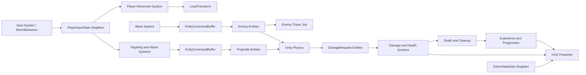

# DOTS Arena 教学 Roadmap

> 本文档是 DOTS Arena 课程的长期事实来源。每次判断课程进度、决定下一步或修改教学代码前，都必须先完整阅读本文档。

最后更新：2026-09-07

当前课程位置：阶段 7「Unity Physics 与碰撞事件」进行中；基础 Authoring、数据组件和系统外围已完成，等待学员实现 `DamageTriggerJob.Execute`。

## 1. 文档用途与维护规则

本文档同时承担四项职责：

1. 保存从阶段 0 到阶段 14 的完整教学路线。
2. 记录实际进度，而不是只记录最初设想。
3. 固化“导师负责什么、学员亲自写什么”的教学边界。
4. 记录课程顺序的调整，防止后续把预留代码误认为已完成玩法。

每次推进课程时遵循以下规则：

1. 先读取本文档的「当前进度」和目标阶段。
2. 再对照仓库与 Unity Editor，确认代码和运行结果一致。
3. 先讲原理；学员确认理解并明确要求实操后，才进入代码实现。
4. 实操时由导师搭建基础代码，把最能体现 DOTS 思维的关键代码留给学员。
5. 学员在 Unity 中验证通过后，才能把阶段标记为完成。
6. 若改变阶段内容或顺序，必须先说明原因，并在「课程调整记录」中登记。

## 2. 教学目标

在当前 Unity 项目中，从底层概念开始构建一款名为 **DOTS Arena** 的俯视角单机生存竞技游戏，同时系统学习 Unity DOTS。

最终可玩版本包含：

- WASD / 手柄移动。
- 玩家自动锁定并攻击附近敌人。
- 敌人批量生成、追踪、碰撞与伤害。
- 子弹、生命值、死亡和清理。
- 波次、经验拾取与升级。
- HUD、暂停、游戏结束与重新开始。
- ECS 性能分析、自动化测试和 Windows PC 构建。

课程不把“写出能运行的代码”作为唯一目标。完成后，学员应能解释每个核心系统的数据输入、输出、更新顺序、线程边界和性能影响。

## 3. 当前项目基线

| 项目 | 当前版本 |
|---|---:|
| Unity | `6000.3.11f1` |
| Entities | `1.4.8` |
| Entities Graphics | `1.4.21` |
| Unity Physics | `1.4.7` |
| Burst | `1.8.29` |
| Collections | `2.6.8` |
| Mathematics | `1.3.3` |
| Input System | `1.19.0` |
| URP | `17.3.0` |
| Unity Test Framework | `1.6.0` |
| MCP for Unity | GitHub `CoplayDev/unity-mcp` main 分支 |

目标平台暂定为 Windows PC。DOTS API 以本项目安装的 Entities 1.4 系列为准，并以 Unity Editor 的实际编译结果校正具体签名。

## 4. 架构边界

课程采用混合架构，而不是强行把所有功能都放进 ECS：

| 边界 | 职责 |
|---|---|
| ECS | 玩家、敌人、子弹、生成、移动、战斗、伤害、死亡、波次等高频模拟 |
| MonoBehaviour | 输入采集、相机、UGUI、按钮和场景编排 |
| Baker | 把 Authoring GameObject 的编辑数据转换为 Entity 组件数据 |
| Entities Graphics | Entity 的运行时渲染 |
| Unity Physics | Collider、Trigger、Collision 和物理事件 |



## 5. 教学协作方式

每个阶段采用同一节奏：

1. 解释本阶段 DOTS 概念、术语和传统 Unity 对应关系。
2. 明确本阶段数据流，以及它在最终游戏循环中的位置。
3. 导师建立最小工程骨架和普通样板代码。
4. 选择一段能体现核心 DOTS 思想的逻辑交给学员亲自实现。
5. 通过 Unity Editor 运行，并观察 Entities Hierarchy、Systems 窗口、Inspector 或 Profiler。
6. 用可观察行为或测试验收，再总结常见错误和性能影响。

代码分工原则：

- 常规 Unity 基础、重复样板、简单数学和文件骨架由导师直接处理。
- Baker、查询、Job 调度、ECB 并行写入、物理事件、状态机等关键 DOTS 代码由学员亲自完成。
- 导师不会为了“提前准备”一次性实现后续阶段逻辑。
- 任何计划外构建、无图形 Player、Batch Mode、关闭或重启 Unity 等操作，都必须事先说明并得到学员同意。
- 编辑器验证优先使用当前已打开的图形化 Unity Editor 和对应 Unity MCP 实例。

## 6. 当前进度

状态定义：

- `已完成`：代码存在，概念已讲解，并由学员在 Unity 中验证。
- `部分完成`：本阶段一部分已验证，剩余内容已明确迁移或待补。
- `进行中`：已经进入本阶段，但尚未完成实操和验收。
- `下一步`：接下来应讲解的阶段，尚未进入实操。
- `未开始`：没有作为正式课程内容开始。

| 阶段 | 状态 | 已验证成果 / 备注 |
|---:|---|---|
| 0. 项目基线与 DOTS 学习环境 | 已完成 | DOTS 包就绪；建立主场景和 SubScene；理解 Open/Closed SubScene 与 Baking |
| 1. ECS 心智模型与第一个实体 | 已完成 | `PlayerAuthoring`、Baker、`PlayerTag`、`MoveSpeed` 与 Primary Entity 已验证 |
| 2. 时间、Transform、渲染与 SubScene | 已完成 | `PlayerMovementSystem` 使用 `DeltaTime` 修改 `LocalTransform`，场景运行正常 |
| 3. 输入桥接与相机 | 已完成 | `PlayerInputState`、`PlayerInputBridge`、Input Actions 与相机跟随已验证，斜向速度已归一化 |
| 4. 实体生成、Prefab 与生命周期 | 部分完成 | 敌人 Entity Prefab、定时生成、ECB 和生命周期已验证；简单子弹按课程调整并入阶段 8 |
| 5. Jobs、Burst 与并行系统 | 已完成 | `LifetimeJob`、`ScheduleParallel`、`AsParallelWriter`、`sortKey` 与依赖链已讲解并验证 |
| 6. 敌人追踪与批量移动 | 已完成 | `EnemyChaseJob` 并行追踪玩家并保留停止距离；已在 Unity 中验证 Worker Thread |
| 7. Unity Physics 与碰撞事件 | 进行中 | Player/Enemy 物理 Authoring、`DamageRequest` 和 Trigger 系统外围已完成；等待学员实现事件双方识别与 ECB 请求记录 |
| 8. 自动攻击、目标选择与战斗循环 | 未开始 | 在这里正式补齐 Projectile Prefab、移动和攻击逻辑 |
| 9. 伤害、生命值、死亡与清理 | 未开始 | 计划保持不变 |
| 10. 波次、随机数与游戏状态 | 未开始 | 计划保持不变 |
| 11. 经验、拾取物与升级 | 未开始 | 计划保持不变 |
| 12. HUD、暂停、重启与表现层 | 未开始 | 计划保持不变 |
| 13. 测试、调试与性能工程 | 未开始 | 计划保持不变 |
| 14. 构建、整理与最终复盘 | 未开始 | 计划保持不变 |

### 当前仓库中的主线成果

```text
Authoring + Baker
  -> PlayerTag + MoveSpeed + PlayerInputState
  -> PlayerMovementSystem
  -> PlayerInputBridge + Camera Follow

Enemy Entity Prefab + EnemySpawner
  -> EnemySpawnSystem + ECB
  -> LifetimeSystem + LifetimeJob
  -> EnemyChaseSystem + EnemyChaseJob
```

### 当前预留但未完成的内容

- 当前仓库没有 `ProjectileTag`、Projectile Authoring、Prefab、移动、碰撞、伤害或攻击链路。
- Projectile 相关数据与玩法将在阶段 8 正式创建；阶段 7 只建立 Player / Enemy 碰撞事件到伤害请求之间的基础接口。

## 7. 分阶段 Roadmap

### 阶段 0：项目基线与 DOTS 学习环境

**本阶段学什么**

- Unity 项目结构和 Packages 配置。
- Entities、SubScene、Baking 和 World 的关系。
- Open / Closed SubScene 的编辑与运行时含义。
- DOTS 与传统 GameObject 工作流的边界。
- Entities Hierarchy、Systems 窗口和 Profiler 的用途。
- 教学项目的目录和命名约定。

**可运行成果**

- 建立主场景、游戏 SubScene 和后续测试入口。
- 配置基础相机、灯光和地面。
- 确认 DOTS 包能够正常编译和运行。

**学员亲自实现**

- 创建第一个 Authoring MonoBehaviour。
- 创建对应 Baker。
- 在 SubScene 中生成一个可被 ECS 查询的 Entity。

**验收方式**

- Unity Console 无持续编译错误。
- Runtime / Converted Scene 数据中能观察到 Entity 与组件。

---

### 阶段 1：ECS 心智模型与第一个实体

**本阶段学什么**

- Entity、Component、System 各自的职责。
- Archetype、Chunk 和数据连续性。
- `IComponentData`、`ISystem` 与 `SystemAPI.Query`。
- Primary Entity、Transform Usage Flags 和 Baker 的无状态转换职责。
- 为什么 DOTS 不是“把 MonoBehaviour 换成另一种脚本”。

**核心数据**

```text
PlayerTag
MoveSpeed
LocalTransform
```

**可运行成果**

- 场景中出现一个 Entity 玩家。
- Entities Hierarchy 中能看到玩家 Entity 和组件。

**学员亲自实现**

- `PlayerAuthoring` 和 `PlayerBaker`。
- 第一个 `ISystem` 的查询骨架。
- 使用 `RefRW<LocalTransform>` 修改位置。

**验收方式**

- Baking 后 Entity 具有预期组件。
- 修改 Authoring 参数会反映到 Runtime Entity 数据。

---

### 阶段 2：时间、Transform、渲染与 SubScene

**本阶段学什么**

- `SystemAPI.Time.DeltaTime`。
- `LocalTransform` 的位置、旋转和缩放。
- Transform 系统和 Entity 层级。
- Entities Graphics 的渲染路径。
- GameObject Prefab 与 Entity Prefab 的区别。
- Baking 阶段和运行时阶段的分工。
- `partial struct` 在 Entities Source Generation 中的作用。

**可运行成果**

- 玩家 Entity 使用 Mesh 和 Material 渲染。
- 玩家按速度和 `DeltaTime` 移动。
- 运行时不依赖 MonoBehaviour `Update()` 移动玩家。

**学员亲自实现**

- 基于 `DeltaTime` 的速度积分。
- 可配置的 `MoveSpeed`。
- 使用一次查询驱动符合条件的多个 Entity。

**验收方式**

- 不同帧率下的单位时间移动距离一致。
- Systems 窗口中能找到并观察移动系统。

---

### 阶段 3：输入桥接与相机

**本阶段学什么**

- Input System Action Map。
- MonoBehaviour 与 ECS World 的数据桥接。
- ECS 单例组件和全局输入状态。
- 值类型组件的复制语义。
- ECS 系统如何读取并“消费”输入数据。
- 为什么相机通常保留在 MonoBehaviour 表现层。

**核心数据**

```text
PlayerInputState
{
    float2 Move;
    float2 Aim;
    byte FirePressed;
}
```

当前只实现 `Move`，`Aim` 与 `FirePressed` 在攻击阶段按需加入。

**可运行成果**

- WASD 或左摇杆控制玩家。
- 相机跟随玩家。
- 输入采集和玩家移动逻辑分离。
- 斜向输入不会比轴向输入更快。

**学员亲自实现**

- `PlayerInputState` 数据组件。
- 输入桥接的 Entity 查询与数据写入。
- 玩家移动系统对输入数据的读取。

**验收方式**

- 输入停止后 Entity 停止移动。
- Runtime Inspector 能看到输入组件值变化。

---

### 阶段 4：实体生成、Prefab 与生命周期

**本阶段学什么**

- Entity Prefab Baking。
- 组件中的 `Entity` 引用。
- `EntityCommandBuffer`。
- 为什么结构变化不能随意发生在遍历或 Job 中。
- Entity 的创建、销毁和清理。
- `Lifetime` 组件。
- `EntityManager.Instantiate` 与 ECB 延迟实例化的差异。

**核心数据**

```text
EnemyTag
ProjectileTag
Lifetime
EnemySpawner
```

**可运行成果**

- 按时间间隔生成敌人。
- 生成后的敌人具有有效 `LocalTransform`。
- 敌人到期后通过 ECB 自动销毁。
- 简单 Entity 子弹原定属于本阶段，但已明确调整到阶段 8，与攻击闭环一起实现。

**学员亲自实现**

- 基于计时器的生成条件。
- 使用 ECB 实例化 Entity Prefab。
- 生命周期递减与销毁请求。

**验收方式**

- Entity 数量按生成间隔增加，并按 Lifetime 减少。
- 运行时能看到生成 Entity，但不要求它们成为 SubScene Authoring Hierarchy 的子对象。

---

### 阶段 5：Jobs、Burst 与并行系统

**本阶段学什么**

- ECS System 与 C# Job System 的关系。
- `IJobEntity`、`Execute` 和 Source Generation。
- `ScheduleParallel` 与 `JobHandle` 依赖链。
- Burst 编译和 unmanaged 数据约束。
- Native 容器与托管对象的边界。
- `EntityCommandBuffer.ParallelWriter` 的并发写入语义。
- `sortKey` 对 Playback 顺序稳定性的作用。
- `Complete()` / `CompleteDependency()` 的同步含义和代价。

**可运行成果**

- 生命周期更新由并行 Job 执行。
- Job 能安全地把销毁命令写入 ECB。
- 能在 Profiler Timeline 中检查 Worker Thread 上的工作。

**学员亲自实现**

- `LifetimeJob.Execute`。
- `AsParallelWriter`。
- `ScheduleParallel(state.Dependency)` 调度和依赖回写。

**验收方式**

- 多个敌人的 Lifetime 正确递减并销毁。
- 系统无 Job 安全错误，Profiler 中能观察调度结果。

---

### 阶段 6：敌人追踪与批量移动

**本阶段学什么**

- ECS 查询过滤与缓存 `EntityQuery`。
- 玩家位置的单例式读取。
- `SystemAPI.Query` 与 `state.GetEntityQuery` 的职责差异。
- 方向归一化、步长积分与停止距离。
- 数据导向的敌人 AI。
- 系统更新顺序和 Transform 更新边界。
- 过早抽象和过度使用 Aspect 的问题。

**核心数据**

```text
EnemyTag
MoveSpeed
LocalTransform
```

`TargetEntity` 会在阶段 8 需要持久目标时再引入，当前追踪只读取唯一玩家位置。

**可运行成果**

- 敌人从出生点向玩家移动。
- 敌人在停止距离边界处停下，不穿过玩家。
- 大量敌人通过 `EnemyChaseJob.ScheduleParallel` 更新。

**学员亲自实现**

- `EnemyChaseJob.Execute` 的目标方向和位置更新。
- Job 的并行调度与依赖回写。

**验收方式**

- 场景行为正确。
- Profiler Timeline 能确认工作被调度到 Worker Thread。

---

### 阶段 7：Unity Physics 与碰撞事件

**本阶段学什么**

- `PhysicsCollider`、`PhysicsVelocity` 和物理 World。
- Collision Filter 的 Category、Mask 和 Group Index。
- Trigger 与 Collision 的语义差异。
- Physics Simulation 所在系统组和事件读取时机。
- `ITriggerEventsJob`。
- 为什么“检测到碰撞”和“应用伤害”必须拆分。
- Job 中只读查找、ECB 记录和事件去重的安全约束。

**计划核心数据**

```text
PhysicsCollider
PhysicsVelocity
ProjectileTag
EnemyTag
PlayerTag
DamageRequest
```

**可运行成果**

- 敌人与玩家发生 Trigger 时能识别双方身份。
- 为后续子弹与敌人的 Trigger 预留同一事件管线。
- Trigger Event 被转换成独立、可后续处理的 `DamageRequest` 数据。

**导师先完成的基础工作**

- Collider Authoring 与 Collision Filter 的场景配置。
- `DamageRequest` 数据结构骨架。
- Physics 系统更新组与查询依赖的外围结构。

**学员亲自实现的关键代码**

- `ITriggerEventsJob.Execute`。
- 判断事件双方标签并标准化 Source / Target。
- 通过 ECB 生成 `DamageRequest` Entity。

**验收方式**

- 只在期望 Layer 组合之间产生 Trigger Event。
- 一次接触能在 Entities Hierarchy 或调试统计中观察到伤害请求。
- 本阶段不直接扣生命值；伤害应用留到阶段 9。

---

### 阶段 8：自动攻击、目标选择与战斗循环

**本阶段学什么**

- 最近目标搜索及其复杂度。
- 攻击范围和攻击冷却。
- 持久 `Entity` 引用与 Entity 有效性。
- Projectile Entity Prefab、方向和速度。
- `EntityCommandBuffer.ParallelWriter` 生成子弹。
- Targeting、Attack、Projectile Movement 的职责拆分。

**核心数据**

```text
AttackCooldown
AttackRange
TargetEntity
ProjectileData
ProjectileTag
Damage
```

**可运行成果**

- 玩家自动寻找范围内最近敌人。
- 玩家按攻击间隔生成 Entity 子弹。
- 子弹沿目标方向移动。
- 子弹与敌人的 Trigger 进入阶段 7 建立的伤害请求管线。

**学员亲自实现**

- 最近目标选择。
- 攻击冷却计时。
- 子弹生成和初始速度计算。

**验收方式**

- 没有目标时不攻击。
- 多个敌人存在时选择规则可预测。
- 攻击频率与帧率无关，Projectile 命中后不重复生效。

---

### 阶段 9：伤害、生命值、死亡与清理

**本阶段学什么**

- 瞬时事件 Entity。
- 伤害请求产生和状态修改的分离。
- `Health`、`DeadTag` 和 Cleanup。
- 结构变化的集中处理。
- 伤害聚合、防止重复死亡和重复奖励。

**核心数据**

```text
Health
Damage
DamageRequest
DeadTag
DeathReward
```

**可运行成果**

- 敌人和玩家能受到伤害。
- Health 归零后只进入一次死亡流程。
- 死亡 Entity 被销毁或进入清理状态。
- 玩家被击败后触发 Game Over 请求。

**学员亲自实现**

- 伤害聚合系统。
- Health 扣减和死亡判定。
- 死亡清理系统。

**验收方式**

- Health 不出现未定义的重复扣减。
- 同一个 Entity 不会重复派发死亡奖励。

---

### 阶段 10：波次、随机数与游戏状态

**本阶段学什么**

- ECS 单例状态。
- `GameStateData` 状态机。
- `Unity.Mathematics.Random` 与可复现随机序列。
- 波次计时和难度递增。
- `[UpdateInGroup]`、`[UpdateBefore]` 和 `[UpdateAfter]`。
- 暂停与 Game Over 对生成、移动和战斗系统的约束。

**核心数据**

```text
GameStateData
WaveState
RandomState
SpawnConfig
```

**可运行成果**

- 游戏具有开始、进行、暂停和 Game Over 状态。
- 敌人按波次生成。
- 波次越高，数量或属性逐步增加。
- 固定随机种子能复现出生序列。

**学员亲自实现**

- 游戏状态机转换。
- 波次计时。
- 随机出生点。
- 敌人数量和难度计算。

**验收方式**

- Game Over 后不再生成敌人。
- 相同种子和输入产生相同波次结果。

---

### 阶段 11：经验、拾取物与升级

**本阶段学什么**

- Pickup Entity 与收集 Trigger。
- 动态缓冲区的适用场景。
- 游戏数据与表现层数据的区别。
- 简单升级选项模型。
- 升级效果如何修改稳定组件数据。

**核心数据**

```text
Experience
Level
PickupTag
UpgradeOption
DynamicBuffer<UpgradeOption>
```

**可运行成果**

- 敌人死亡后生成经验拾取物。
- 玩家接触拾取物后获得经验。
- 经验达到阈值后升级。
- 升级能增加攻击力、移动速度或攻击范围。

**学员亲自实现**

- 经验拾取系统。
- 升级阈值计算。
- 升级效果应用。

**验收方式**

- 拾取物只结算一次。
- 连续跨越多个阈值时等级和剩余经验正确。

---

### 阶段 12：HUD、暂停、重启与表现层

**本阶段学什么**

- ECS 数据到 UGUI 的低频投影。
- MonoBehaviour Presenter。
- 为什么 UI 不直接参与高频模拟。
- 暂停状态与系统组控制。
- 重开一局时如何清理 ECS World 状态。
- 相机、UI、输入的双向混合架构。

**可运行成果**

- HUD 显示生命值、经验、等级和波次。
- 显示暂停与 Game Over 面板。
- 可以重新开始一局。
- UI 按钮能向 ECS 写入状态请求。

**学员亲自实现**

- `HudPresenter` 的 ECS 数据读取。
- 状态到 UI 的映射。
- 暂停和重启按钮的事件桥接。

**验收方式**

- UI 更新不产生每帧不必要的托管分配。
- 重启后没有上一局 Entity 或状态残留。

---

### 阶段 13：测试、调试与性能工程

**本阶段学什么**

- EditMode 与 PlayMode 测试边界。
- 使用测试 World 创建 Entity 和运行 System。
- 确定性测试。
- Entities Hierarchy、Systems 窗口与 System Schedule。
- Burst Inspector、Profiler 和 Memory Profiler。
- 结构变化、查询范围与 GC 分配。
- Entity 池化的适用条件，而不是默认使用池化。

**测试目标**

- 移动系统使用正确的 `DeltaTime`。
- 攻击冷却不会提前触发。
- 波次生成数量符合配置。
- 伤害应用后 Health 不低于约定下限。
- 死亡 Entity 不会重复奖励。
- Game Over 后不会继续生成敌人。
- 重启后不存在上一局残留 Entity。

**性能验收**

- 1000 个敌人同时运行时，模拟循环无每帧托管分配。
- 高频系统能够 Burst 编译。
- 对 100、1000、5000 个敌人记录帧时间和 Entity 数量。
- 对比优化前后的查询范围、结构变化和 Job 调度成本。

**学员亲自实现**

- 至少 4 个 ECS System 测试。
- 1 个 PlayMode 端到端测试。
- 1 份性能优化前后对比报告。

---

### 阶段 14：构建、整理与最终复盘

**本阶段学什么**

- Build Profile 和 Windows PC 构建。
- Development Build 与发行构建的差异。
- Scene、SubScene 与构建依赖。
- 教学代码的最终分层。
- DOTS 方案与传统 Unity 方案的取舍。
- 何时应该使用 ECS，何时不应该使用 ECS。

**最终验收**

- 从启动场景进入游戏。
- 能完成一局完整游戏。
- 能暂停、升级、Game Over 和重新开始。
- Windows PC 构建可以独立运行。
- Console 无持续报错。
- 能在 Profiler 中解释热点系统。
- 每个核心系统都有明确的数据输入、输出和更新顺序。

**学员亲自完成**

- 根据 Profiler 证据解释一个热点。
- 对一个功能说明选择 ECS 或 MonoBehaviour 的理由。
- 完成最终架构复盘。

## 8. 稳定的数据契约

以下类型是课程主线的稳定词汇。只有到对应阶段才创建，不应因为它出现在 Roadmap 中就提前实现。

| 类型 | 作用 | 引入阶段 |
|---|---|---:|
| `PlayerTag` | 标识玩家 Entity | 1 |
| `EnemyTag` | 标识敌人 Entity | 4 |
| `ProjectileTag` | 标识子弹 Entity | 4 预留，8 正式使用 |
| `PickupTag` | 标识拾取物 | 11 |
| `MoveSpeed` | 移动速度 | 1 |
| `Health` | 当前和最大生命值 | 9 |
| `Damage` | 攻击携带的伤害量 | 8 |
| `AttackCooldown` | 攻击冷却状态 | 8 |
| `Lifetime` | Entity 剩余生存时间 | 4 |
| `PlayerInputState` | 输入桥接后的 ECS 值数据 | 3 |
| `TargetEntity` | 当前目标 Entity 引用 | 8 |
| `DamageRequest` | 瞬时伤害事件 | 7 |
| `GameStateData` | 游戏状态机 | 10 |
| `WaveState` | 波次、计时和难度 | 10 |
| `RandomState` | 确定性随机状态 | 10 |
| `UpgradeOption` | 升级选项数据 | 11 |

计划中的主要系统顺序：

```text
InputBridge (MonoBehaviour)
  -> PlayerMovementSystem
  -> EnemyChaseSystem
  -> TargetingSystem
  -> AttackSystem
  -> ProjectileMovementSystem
  -> Unity Physics Simulation
  -> TriggerEventSystem
  -> DamageRequestSystem
  -> HealthSystem
  -> DeathCleanupSystem
  -> ExperienceSystem
  -> WaveSystem
  -> HudPresenter (MonoBehaviour)
```

最终实现时必须用系统组和显式更新约束验证顺序，不能只依赖这份文本排列。

## 9. 重点自实现代码清单

学员至少亲自完成以下关键代码：

1. Baker 把 Authoring 数据转换成 Entity 组件。
2. `ISystem` 查询并修改 `LocalTransform`。
3. Input System 到 `PlayerInputState` 单例的桥接。
4. ECB 实例化敌人和子弹。
5. `IJobEntity.ScheduleParallel` 批量更新 Entity。
6. `ITriggerEventsJob` 识别碰撞双方。
7. `DamageRequest` 到 Health 扣减的事件处理。
8. `GameStateData` 和 `WaveState` 状态机。
9. 经验收集与升级计算。
10. HUD Presenter 读取 ECS 状态。
11. ECS System 测试和 PlayMode 测试。
12. 一次针对查询、结构变化或 GC 的性能优化。

已经完成的自实现项：1、2、3、4 中的敌人生成部分、5。下一项是 6。

## 10. 全课程测试计划

每个阶段都必须满足“能运行、能观察、能验证”：

- 编译检查：脚本无编译错误，Baking 成功。
- 行为检查：Scene 中的 Entity 行为符合阶段目标。
- ECS 检查：组件、Entity 数量和系统更新顺序符合预期。
- EditMode 测试：验证纯数据计算与 System 逻辑。
- PlayMode 测试：验证输入、战斗、死亡和重启流程。
- 性能检查：记录 Entity 数量、帧时间、Burst 状态和 GC 分配。
- 构建检查：仅在阶段 14 且事先说明后，验证 Windows PC 构建。

Unity 验证规则：

- 优先使用当前打开的 Unity Editor 与正确 URL 对应的 Unity MCP 实例。
- 不以关闭编辑器换取命令行测试。
- 不在阶段 14 前擅自使用 Standalone、无图形 Player 或 Batch Mode 作为常规阶段验收。
- 如果 MCP 暂时不可用，先说明限制，再选择不会干扰学员编辑器的替代验证方式。

## 11. 课程调整记录

| 日期 | 调整 | 原因 |
|---|---|---|
| 2026-09-07 | 建立本 Roadmap，并把它设为后续教学进度的事实来源 | 防止长期对话中阶段顺序和完成状态漂移 |
| 2026-09-07 | 将阶段 4 原定的“简单子弹”明确并入阶段 8 | 子弹需要目标选择、攻击冷却、移动与碰撞才能形成完整可理解的数据流，提前放置会造成未完成逻辑和学习负担 |
| 2026-09-07 | 阶段 7 保持只产出碰撞事件和 `DamageRequest`，不直接扣血 | 用数据事件分离 Physics Detection 与 Gameplay State Mutation |
| 2026-09-07 | 将阶段 7 的“并行 ECB”改为“ECB 记录” | 本项目 Unity Physics 1.4.7 的 `ITriggerEventsJob` 以 `ScheduleMode.Single` 调度，不应套用 `IJobEntity.ScheduleParallel` 的语义 |
| 2026-09-07 | 阶段 7 状态更新为“进行中（原理讲解）” | 学员已明确要求开始阶段 7，但尚未要求进入实操 |
| 2026-09-07 | 修正 Projectile 当前状态 | 最新仓库已不包含此前的 `ProjectileTag` 预留文件，相关数据保持到阶段 8 再创建 |
| 2026-09-07 | 完成阶段 7 基础搭建 | Player/Enemy 已 Baking 为 Trigger Kinematic Body，`DamageRequest` 与 Trigger Job 外围已编译；关键 `Execute` 保留给学员 |

## 12. 下一步检查点

开始阶段 7 时，严格按以下顺序推进：

1. 先讲清 Unity Physics 在 ECS World 中的数据与执行位置。
2. 对比 Trigger 和 Collision，以及 Collision Filter 的过滤机制。
3. 解释 `ITriggerEventsJob` 为什么只产生事件数据，不直接处理 Health。
4. 学员确认理解后，再共同划分导师样板代码与学员关键代码。
5. 学员明确说“开始实操”后，才编辑阶段 7 代码或场景。

## 13. 审计式分析摘要

### Problem Breakdown

这是一个长期教学型项目，需要同时保持概念递进、每阶段可运行、最终玩法闭环，以及“导师不提前写完关键代码”的学习节奏。聊天记录本身会增长和压缩，不能作为唯一进度来源。

### Evidence

- 当前包清单包含 Entities、Entities Graphics、Unity Physics、Burst、Collections、Mathematics、Input System、URP 和 Test Framework。
- 当前仓库已有玩家 Baking、输入桥接、玩家移动、敌人生成、生命周期 Job 和敌人追踪 Job。
- 学员已在 Unity 中验证敌人追踪，并确认可以进入下一阶段。
- `ProjectileTag` 存在，但没有完整 Projectile Prefab 与战斗系统，因此不能标记子弹玩法完成。

### Inference Summary

把阶段状态、验收条件和课程调整写入仓库，能够让后续教学以可核对的文件为准。把子弹正式实现集中到阶段 8，可以在阶段 7 先单独理解物理事件，再在阶段 8 形成完整攻击链路，避免概念互相遮蔽。

### Assumptions

- 学员熟悉 C# 和常规 Unity 工作流，基础数学不作为单独作业。
- 继续使用当前 Unity 6000.3 与 Entities 1.4 API。
- 目标平台仍为 Windows PC。
- 网络多人、复杂动画、NavMesh、持久化存档和移动端适配不属于第一版。

### Alternative Explanations

- 可以在阶段 4 就做一次性子弹，但它会依赖尚未教授的目标选择、物理事件和伤害职责，形成难以解释的半成品。
- 可以只依赖聊天历史跟踪进度，但上下文压缩和长期迭代容易让状态失真。
- 可以把完整实现一次性写完再逐段讲解，但这与当前“先理解、后实操、关键代码由学员完成”的教学协议冲突。

### Verification Method

- 每次推进前读取本文档。
- 对照仓库文件和 Unity Editor 的实际运行状态。
- 只有在学员验证后更新阶段状态。
- 用「课程调整记录」审计所有阶段顺序变化。

### Conclusion

后续课程以本文档为唯一 Roadmap 基准。目前应从阶段 7 的原理讲解开始，不能提前进入阶段 8 的 Projectile 或伤害实现。
